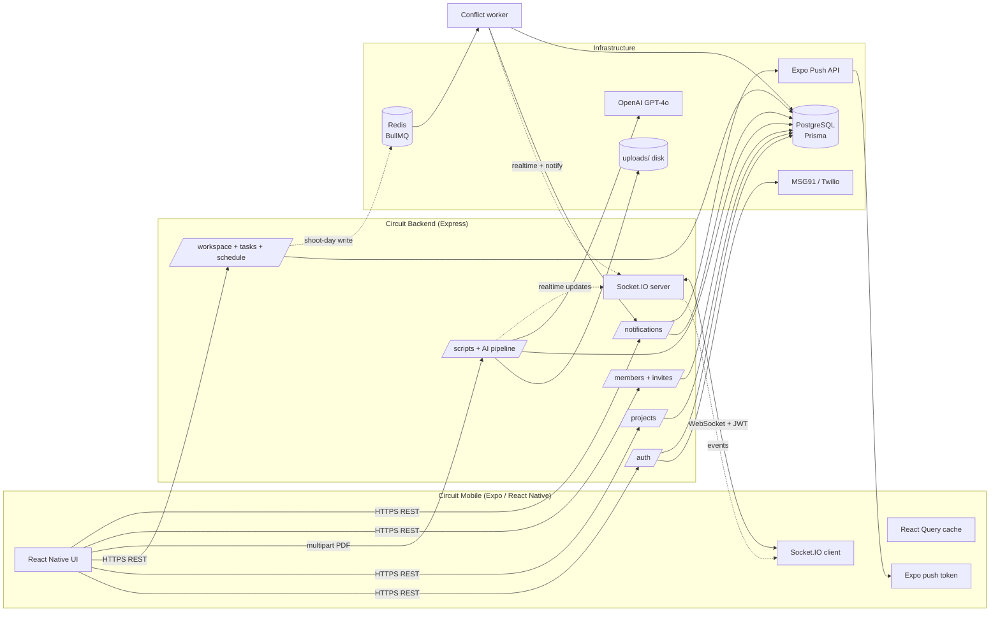
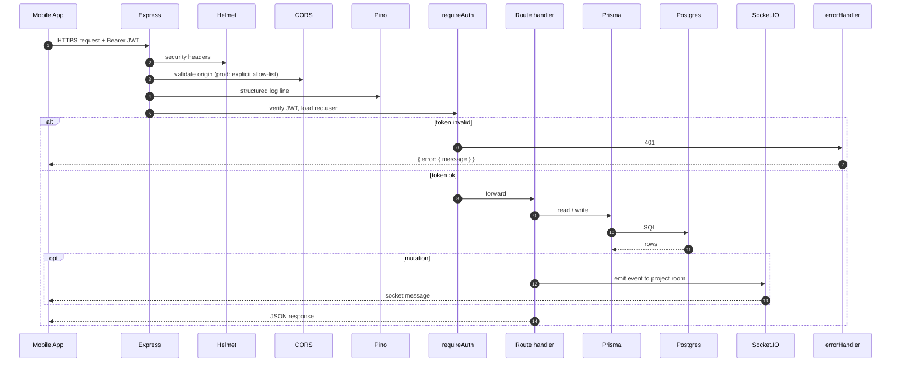
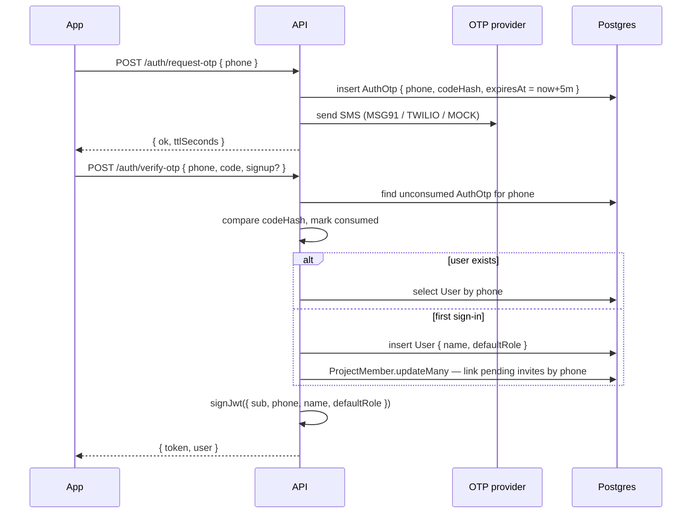
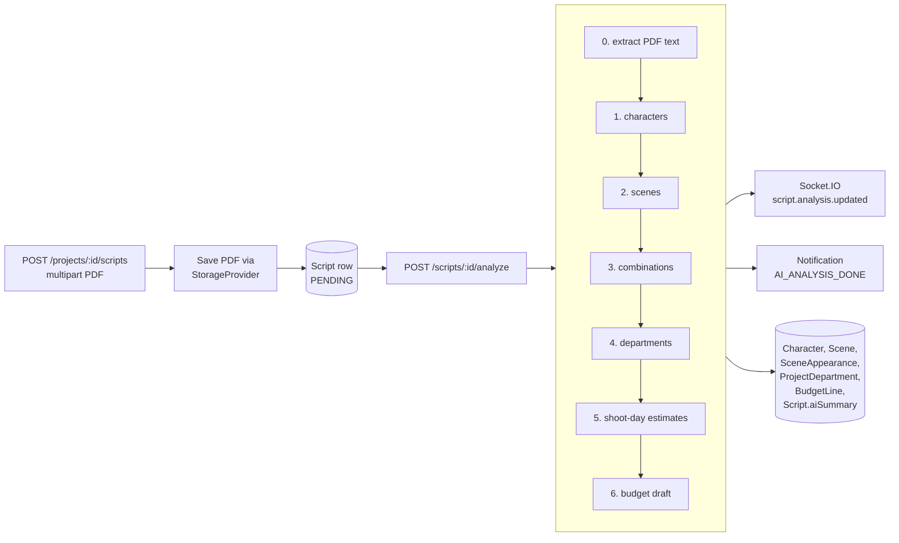
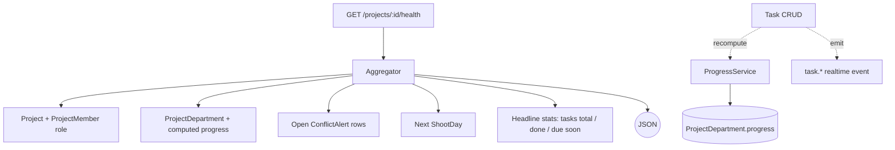
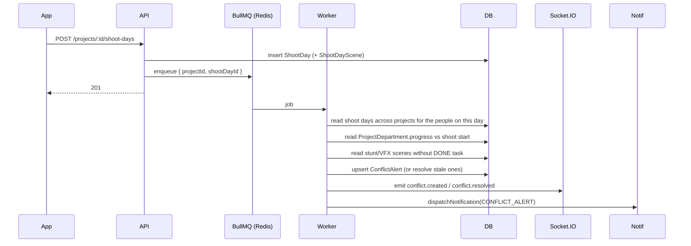

# Circuit Backend — Architecture

> **v1 (minor release) note:** Circuit ships first as a **limited‑functionality v1** — a
> subset of the modules below is enabled now; the rest are **deferred to a future full
> release** (see [PRODUCT.md](./PRODUCT.md) for the v1 scope and [MIGRATION.md](./MIGRATION.md)
> for what's deferred). The **architecture and stack stay the same** — nothing here is removed,
> v1 simply turns on a subset. The mobile app adopts a new visual language
> (`../mobile/docs/DESIGN-SYSTEM.md`); the backend is unaffected by styling.

A detailed map of how the Circuit MVP backend is structured, how data flows
from the mobile app to Postgres, and how the cross-cutting subsystems
(AI pipeline, realtime, queues, notifications, storage) fit together.

> **Stack:** Node.js 20+ · Express · Prisma · PostgreSQL · Redis · Socket.IO ·
> BullMQ · OpenAI · local disk (uploads/) · Expo Push

---

## 1. High-level system view



### Why these choices

| Concern         | Decision                                         | Reason                                                     |
| --------------- | ------------------------------------------------ | ---------------------------------------------------------- |
| API framework   | **Express 4**                                    | Minimal, battle-tested, easy to host on Render/Railway     |
| ORM             | **Prisma**                                       | Typed schema, painless migrations, strong dev ergonomics   |
| Realtime        | **Socket.IO**                                    | Built-in JWT handshake, rooms, auto-reconnect, RN-friendly |
| Background jobs | **BullMQ + Redis**                               | Per-event conflict scans without a 1-minute cron lag       |
| AI calls        | **OpenAI strict JSON schema + Zod**              | Removes 90% of "AI returned garbage" failures              |
| File storage    | **Local disk (`uploads/`)**                      | Simple on Render; add persistent disk for prod uploads     |
| OTP             | **MSG91 / Twilio adapters behind one interface** | Swap providers without touching routes                     |
| Push            | **Expo Push API**                                | Single endpoint for iOS + Android dev clients              |

---

## 2. Repository layout

```text
apps/api/
├── prisma/
│   ├── schema.prisma                # source of truth for all tables
│   └── migrations/                  # SQL migrations (prisma migrate deploy)
│
├── src/
│   ├── server/
│   │   └── index.ts                 # Express bootstrap, route mount, socket init,
│   │                                # BullMQ worker start, graceful shutdown
│   │
│   ├── config/
│   │   ├── load-env.ts              # loads `.env.development` (local)
│   │   └── env.ts                   # Zod-validated env
│   │
│   ├── lib/                         # cross-cutting infra
│   │   ├── prisma.ts                # singleton PrismaClient
│   │   ├── logger.ts                # pino logger + pino-pretty in dev
│   │   ├── jwt.ts                   # sign / verify JWT
│   │   └── http.ts                  # error helpers (badRequest, unauthorized, ...)
│   │
│   ├── middleware/
│   │   ├── auth.ts                  # requireAuth, requireProjectRole
│   │   └── error.ts                 # top-level errorHandler
│   │
│   ├── modules/                     # one folder per HTTP module
│   │   ├── auth/                    # /auth/* — OTP, JWT, /me
│   │   │   ├── auth.routes.ts
│   │   │   ├── otp.service.ts
│   │   │   └── providers/
│   │   │       ├── phone-otp.provider.ts    # MSG91 / MOCK (channel=PHONE)
│   │   │       └── resend-email-otp.provider.ts  # Resend / MOCK (channel=EMAIL)
│   │   ├── projects/                # /projects/* — create + list
│   │   ├── scripts/                 # /projects/:id/scripts upload + analyze
│   │   ├── members/                 # invite / accept / remove
│   │   ├── tasks/                   # task CRUD + dept progress recompute
│   │   ├── shoot-days/              # schedule CRUD + auto-enqueue conflict scan
│   │   ├── workspace/               # /projects/:id/health aggregator
│   │   ├── characters/              # AI override + isEdited badge
│   │   ├── scenes/                  # AI override + re-scan on stunt/VFX flip
│   │   └── departments/             # rename / budget-line CRUD
│   │
│   ├── ai/                          # Module 2 — 6-stage GPT pipeline
│   │   ├── pipelines/
│   │   │   └── script-analysis.pipeline.ts
│   │   ├── prompts/                 # one file per stage prompt
│   │   ├── schemas.ts               # Zod schemas mirrored as JSON schema
│   │   ├── openai.client.ts         # chatJson() with strict schema retry
│   │   ├── zod-to-json-schema.ts
│   │   └── pdf.ts                   # pdf-parse wrapper
│   │
│   ├── realtime/
│   │   ├── socket.ts                # io server, JWT handshake, room mgmt
│   │   └── events.ts                # RealtimeTopic enum + buildEvent
│   │
│   ├── queues/
│   │   ├── redis.ts                 # ioredis singletons
│   │   ├── conflicts.queue.ts       # BullMQ queue + worker (inline fallback)
│   │   └── conflict-detector.service.ts  # the 3-category scan
│   │
│   ├── notifications/
│   │   ├── notifications.routes.ts  # inbox + push-token endpoints
│   │   ├── notifications.service.ts # dispatchNotification() — single fan-out
│   │   └── expo-push.provider.ts    # Expo Push API client
│   │
│   └── storage/
│       ├── types.ts                 # StorageProvider interface
│       ├── local.provider.ts        # disk-backed (uploads/)
│       └── index.ts                 # getStorage()
│
├── tests/                           # vitest suite (prompts, chatJson, push)
├── docker-compose.yml               # Postgres + Redis (dev)
├── tsconfig.json
└── package.json
```

---

## 3. Request lifecycle (REST)

Every authenticated REST call follows the same pipeline:



### Middleware order (`src/server/index.ts`)

1. `helmet()` — security headers (CSP, HSTS, etc.)
2. `compression()` — gzip large responses
3. `express.json({ limit: '2mb' })` — small JSON only; PDFs use multer
4. `cors()` — allow-list in prod, permissive in dev
5. `pino-http` — request log line, skips `/health`
6. **Public routes:** `/health`, `/auth/request-otp`, `/auth/verify-otp`
   (rate-limited 10 req/min in prod)
7. **Protected routes:** everything else, gated by `requireAuth` and (where
   relevant) `requireProjectRole`
8. **404 fallback + `errorHandler`** — last-resort JSON error envelope

---

## 4. Authentication flow (phone OTP)



- **Dev:** `OTP_PROVIDER=MOCK` returns a fixed code `111111` (server-side
  check), so testers don't need real SMS.
- **Prod:** flip to `MSG91` (or `TWILIO`) and provide the auth key + template id.
- **Auto-linking:** if an invite was created against the same phone, the
  invitee's `userId` gets backfilled on first sign-in, so their pending
  invites surface immediately under `GET /auth/me/invites`.

---

## 5. AI script intelligence (Module 2)



### Per-stage contract

| Stage | Prompt builder            | Output schema                  | Persisted to                          |
| ----- | ------------------------- | ------------------------------ | ------------------------------------- |
| 0     | n/a                       | raw text                       | `Script.rawText`, `Script.pageCount`  |
| 1     | `buildCharactersPrompt`   | `aiCharactersResponseSchema`   | `Character`                           |
| 2     | `buildScenesPrompt`       | `aiScenesResponseSchema`       | `Scene` + `SceneAppearance`           |
| 3     | `buildCombinationsPrompt` | `aiCombinationsResponseSchema` | `Script.aiSummary.combinations`       |
| 4     | `buildDepartmentsPrompt`  | `aiDepartmentsResponseSchema`  | `ProjectDepartment`                   |
| 5     | `buildShootDaysPrompt`    | `aiShootDaysResponseSchema`    | `Script.aiSummary.estimatedShootDays` |
| 6     | `buildBudgetPrompt`       | `aiBudgetResponseSchema`       | `BudgetLine`                          |

- **`chatJson()`** uses OpenAI **strict JSON Schema** + Zod parse as a safety
  net. On a schema mismatch it retries once with a tighter system prompt
  before failing the stage.
- **`Script.analysisStatus`** advances through the
  `ScriptAnalysisStatus` enum so the mobile screen can show a progress bar.
- **Human override:** leadership can PATCH `Character`, `Scene`,
  `ProjectDepartment`, or `BudgetLine`; we set `isEdited=true`,
  `editedByUserId`, `editedAt`, and emit `*.updated` realtime events.

---

## 6. Project workspace (Module 3)



- **Health ring** (`workspace.routes.ts`) is a single aggregator that the
  mobile dashboard polls and re-fetches on `task.*` / `shootday.*` /
  `conflict.*` realtime events.
- **Department progress** is recomputed on every task status change, so the
  ring updates the instant a crew member taps "DONE" on Kanban.
- **DEPT_HEAD scoping:** reads on `/health`, `/tasks`, `/conflicts` are
  automatically filtered to the user's department in `requireProjectRole`.
- **Spider mode** is a client-side rendering of multiple projects — the
  backend just lists them; no special API.

---

## 7. Schedule & conflict engine (Module 5)



### Three conflict categories

1. **SCHEDULE_CLASH** — same person called on two different projects on the
   same calendar date. Severity `CRITICAL`.
2. **DEPT_BEHIND** — required department's `progress` is below a sliding
   expectation curve based on `daysUntilShoot`.
3. **MISSING_DEPENDENCY** — upcoming shoot day has a stunt/VFX scene with no
   DONE task in the matching department yet.

### Coalescing

Jobs are coalesced per `(projectId, shootDayId)` so rapid edits collapse to
a single scan. If `REDIS_URL` is unset (dev only), scans run **inline** on
the request thread — the worker is optional but recommended for prod.

---

## 8. Realtime layer

Mobile clients open a single Socket.IO connection at the same origin as the
REST API. After JWT handshake, they join one room per project:

```ts
io(API_BASE_URL, { auth: { token }, transports: ['websocket'] });
socket.emit('join', { projectId });
```

All events are sent as a single `event` message with this envelope:

```ts
{
  topic: 'task.updated' | 'shootday.created' | 'conflict.created' | ...,
  projectId: '...',
  ts: '2026-...',
  data: { /* topic-specific */ }
}
```

Topics:

- **Workspace:** `task.created`, `task.updated`, `task.deleted`,
  `shootday.created`, `shootday.updated`, `shootday.deleted`,
  `member.invited`, `member.updated`
- **Alerts:** `conflict.created`, `conflict.resolved`
- **AI pipeline:** `script.analysis.updated`
- **AI edits:** `character.updated`, `scene.updated`,
  `department.updated`, `budgetline.updated`
- **Inbox:** `notification.created` — fired on the user's `user:{id}` room,
  not the project room, so any signed-in device gets pinged.

The mobile app maps each topic to a React Query cache key and invalidates
it on receipt — no manual refresh code in screens.

---

## 9. Notification fan-out

`dispatchNotification()` in `notifications/notifications.service.ts` is the
**single fan-out point** the rest of the codebase calls. For each recipient
it:

1. Writes an `IN_APP` `Notification` row (with `kind`, `deepLink`,
   `contextJson`).
2. Looks up that user's registered `PushToken` rows.
3. Calls the Expo Push provider (`MOCK` in dev, `EXPO` in prod).
4. Records the resulting ticket id or error on the `Notification` row.
5. Prunes any `PushToken` that came back with a fatal Expo error
   (`DeviceNotRegistered`, `MismatchSenderId`, etc.).
6. Emits `notification.created` to the user's Socket.IO room.

Wired call sites:

| Trigger                       | Kind               |
| ----------------------------- | ------------------ |
| Conflict detector             | `CONFLICT_ALERT`   |
| Shoot-day call upsert         | `SHOOT_DAY_CALL`   |
| Member invite (existing user) | `PROJECT_INVITE`   |
| Task create / reassignment    | `TASK_ASSIGNED`    |
| AI pipeline COMPLETED         | `AI_ANALYSIS_DONE` |

---

## 10. Storage

Script PDFs are stored on local disk under `uploads/` (see `src/storage/local.provider.ts`).

On Render, mount a **persistent disk** at `/app/uploads` if uploads must survive redeploys.

The `Script.storageKey` column stores the file path/key used by the local provider.

---

## 11. Environment matrix

Cross-stack view (mobile + backend + DB + OTP): see [DEPLOYMENT.md § Recommended environment matrix](./DEPLOYMENT.md#recommended-environment-matrix).

Backend-only variables by tier:

| Variable             | Dev (Docker)                                      | Prod (Render)                      |
| -------------------- | ------------------------------------------------- | ---------------------------------- |
| `NODE_ENV`           | `development`                                     | `production`                       |
| `DATABASE_URL`       | `postgresql://circuit@localhost:5432/circuit_dev` | Supabase pooler or Render Postgres |
| `REDIS_URL`          | `redis://localhost:6379` _(optional)_             | Render Redis URL _(optional)_      |
| `JWT_SECRET`         | dev placeholder                                   | strong random ≥ 32 chars           |
| `OTP_PROVIDER`       | `MOCK` (fixed code `111111`)                      | `MSG91` / `TWILIO`                 |
| `EXPO_PUSH_PROVIDER` | `MOCK`                                            | `EXPO`                             |
| `OPENAI_API_KEY`     | dev key                                           | real key                           |
| `CORS_ORIGINS`       | localhost origins                                 | empty OK for mobile-only           |

Full schema lives in `src/config/env.ts` — invalid envs **fail boot** with
a printed list of missing/invalid values.

---

## 12. Graceful shutdown

```ts
process.on('SIGINT' | 'SIGTERM', shutdown);
```

`shutdown()` runs:

1. Stop the BullMQ conflict worker so no new jobs start.
2. Disconnect ioredis.
3. Close the HTTP/Socket.IO server (drains in-flight requests).
4. `prisma.$disconnect()`.
5. `process.exit(0)`.

This keeps Railway / ECS deployments rolling without dropping connections.

---

## 13. Test surface

```text
tests/
├── ai/
│   ├── prompt-builders.test.ts   # prompts include required inputs
│   ├── chat-json.test.ts         # mocked OpenAI: valid + bad JSON + schema mismatch
│   └── eval.test.ts              # canned-summary regression
└── notifications/
    └── expo-push.test.ts         # mock-mode behaviour + fatal error set
```

`vitest run` completes the full suite in <500 ms; CI also runs
`typecheck`, `prisma validate`, and `eslint`.

---

## 14. Operational playbook

| Symptom                      | Look at                                                           |
| ---------------------------- | ----------------------------------------------------------------- |
| Sign-in stuck "Sending code" | `auth.routes.ts` log; check `OTP_PROVIDER` env                    |
| Script stuck "ANALYZING\_…"  | `script-analysis.pipeline.ts` log line; OpenAI quota              |
| Conflict alerts not firing   | `conflicts.queue.ts` worker log; `REDIS_URL` reachable?           |
| Push not delivered           | `expo-push.provider.ts` ticket result + `PushToken.pushError`     |
| Realtime not updating UI     | confirm client joined `project:{id}` room; check JWT in handshake |
| 401 loop on mobile           | `requireAuth` rejected the JWT — likely `JWT_SECRET` rotated      |

---

## 15. Future work (tracked in README §11)

1. Production OTP — finish MSG91 wiring (key + template id).
2. `@circuit/shared` package — extract Zod schemas + types so backend and
   mobile share one source of truth.
3. AI per-stage caching by `(scriptId, stage, promptHash)`.
4. Per-conflict resolve / reschedule action sheet on mobile.
5. Pull route-level role gating into one policy module instead of
   per-route allow-lists.
