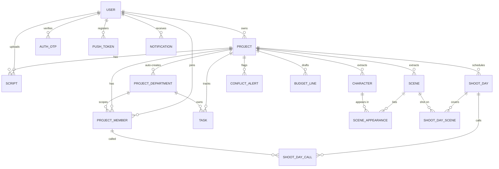
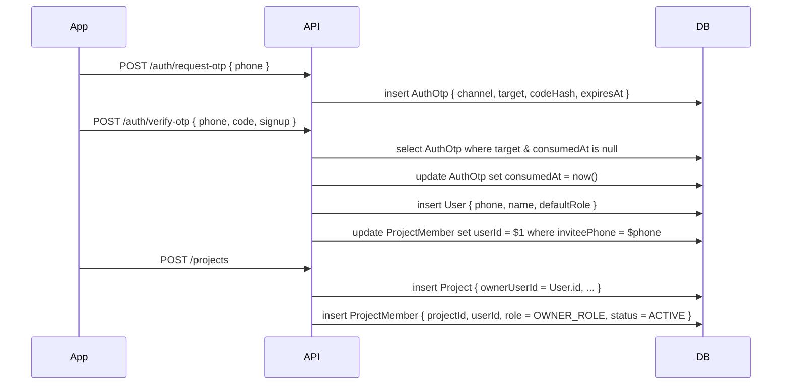
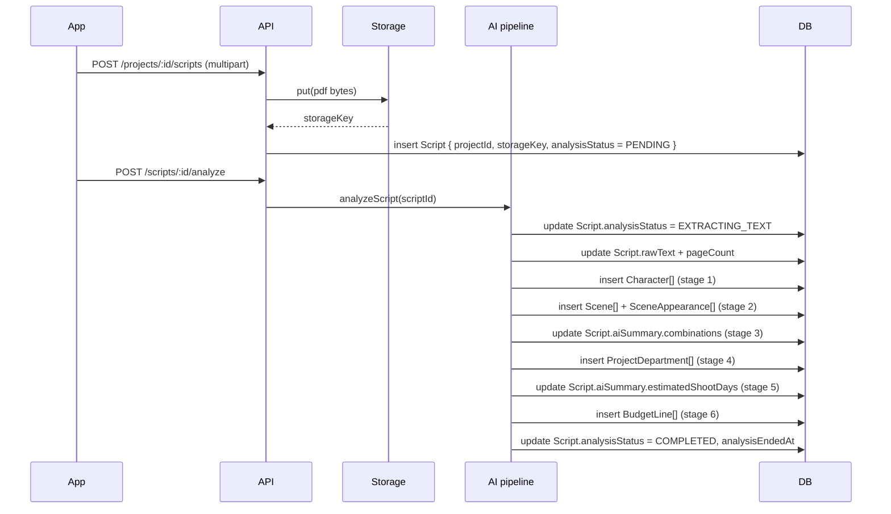
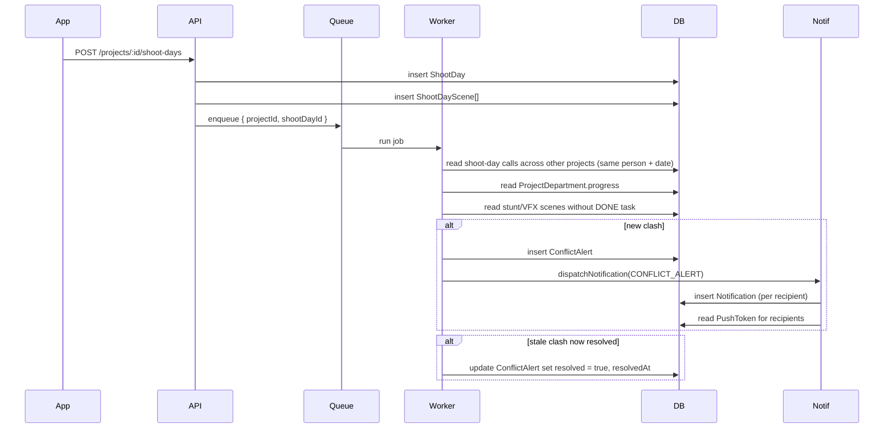

# Circuit Backend — Database Reference

> **v1 (minor release) note:** The schema below is the **full Circuit data model** and is
> **kept intact**. v1 simply exercises a subset of these tables (the rest back deferred
> features). No tables are dropped for v1. See [PRODUCT.md](./PRODUCT.md) and
> [MIGRATION.md](./MIGRATION.md).

A column-by-column reference for every table in `prisma/schema.prisma`,
plus the relationships, enums, and indexes that hold the schema together.

> **Engine:** PostgreSQL 16 • **ORM:** Prisma 5 • **Naming:** PascalCase
> tables and camelCase columns, matching the Prisma client output.

Conventions used in this document:

- `PK` = primary key, `FK` = foreign key.
- `?` after a type means the column is nullable.
- `default(...)` shown for non-trivial defaults only.

---

## 1. Entity map (high level)



---

## 2. Modules → tables

| Module                              | Owning tables                                                                        |
| ----------------------------------- | ------------------------------------------------------------------------------------ |
| **Module 1** Onboarding + projects  | `User`, `AuthOtp`, `Project`, `ProjectMember`                                        |
| **Module 2** AI script intelligence | `Script`, `Character`, `Scene`, `SceneAppearance`, `ProjectDepartment`, `BudgetLine` |
| **Module 3** Workspace              | `Task`, `ProjectDepartment` (progress), `ShootDay`, `ShootDayScene`, `ShootDayCall`  |
| **Module 4** Team & Spider          | `ProjectMember`, `User`                                                              |
| **Module 5** Conflict & alerts      | `ConflictAlert`, `Notification`, `PushToken`                                         |

---

## 3. Enums

| Enum                   | Values                                                                                                                                                                                          | Used by                                           |
| ---------------------- | ----------------------------------------------------------------------------------------------------------------------------------------------------------------------------------------------- | ------------------------------------------------- |
| `UserRole`             | `DIRECTOR`, `PRODUCER`, `EXECUTIVE_PRODUCER`, `LINE_PRODUCER`, `AD`, `DOP`, `DEPT_HEAD`, `CREW`, `ACTOR`, `VENDOR`                                                                              | `User.defaultRole`, `ProjectMember.role`          |
| `MembershipStatus`     | `INVITED`, `ACTIVE`, `REMOVED`                                                                                                                                                                  | `ProjectMember.status`                            |
| `ProjectStage`         | `PRE_PRODUCTION`, `PRODUCTION`, `POST_PRODUCTION`                                                                                                                                               | `Project.currentStage`                            |
| `ProjectLanguage`      | `TELUGU`, `HINDI`, `TAMIL`, `MALAYALAM`, `KANNADA`, `ENGLISH`, `OTHER`                                                                                                                          | `Project.language`, `Project.languages[]`         |
| `ScriptAnalysisStatus` | `PENDING`, `EXTRACTING_TEXT`, `ANALYZING_CHARACTERS`, `ANALYZING_SCENES`, `ANALYZING_COMBINATIONS`, `SUGGESTING_DEPARTMENTS`, `ESTIMATING_SHOOT_DAYS`, `DRAFTING_BUDGET`, `COMPLETED`, `FAILED` | `Script.analysisStatus`                           |
| `CharacterImportance`  | `LEAD`, `SUPPORT`, `DAY_ROLE`                                                                                                                                                                   | `Character.importance`                            |
| `SceneLocationType`    | `INTERIOR`, `EXTERIOR`, `INT_EXT`                                                                                                                                                               | `Scene.locationType`                              |
| `SceneTimeOfDay`       | `DAY`, `NIGHT`, `DAWN`, `DUSK`, `UNSPECIFIED`                                                                                                                                                   | `Scene.timeOfDay`                                 |
| `DepartmentKind`       | `DIRECTION`, `PRODUCTION`, `CASTING`, `DOP_CAMERA`, `ART`, `COSTUME`, `MAKEUP_HAIR`, `STUNTS`, `VFX`, `SOUND`, `MUSIC`, `LOCATION`, `EDITORIAL`, `POST_DI`, `POST_SOUND`, `OTHER`               | `ProjectDepartment.kind`, `BudgetLine.department` |
| `TaskStatus`           | `TODO`, `IN_PROGRESS`, `DONE`, `BLOCKED`                                                                                                                                                        | `Task.status`                                     |
| `TaskPriority`         | `LOW`, `MEDIUM`, `HIGH`, `URGENT`                                                                                                                                                               | `Task.priority`                                   |
| `ConflictKind`         | `SCHEDULE_CLASH`, `DEPT_BEHIND`, `MISSING_DEPENDENCY`                                                                                                                                           | `ConflictAlert.kind`                              |
| `ConflictSeverity`     | `INFO`, `WARNING`, `CRITICAL`                                                                                                                                                                   | `ConflictAlert.severity`                          |
| `NotificationChannel`  | `PUSH`, `SMS`, `IN_APP`                                                                                                                                                                         | `Notification.channel`                            |
| `NotificationKind`     | `CONFLICT_ALERT`, `TASK_ASSIGNED`, `TASK_DUE_SOON`, `SHOOT_DAY_UPDATED`, `SHOOT_DAY_CALL`, `PROJECT_INVITE`, `AI_ANALYSIS_DONE`, `GENERIC`                                                      | `Notification.kind`                               |
| `PushPlatform`         | `IOS`, `ANDROID`, `WEB`                                                                                                                                                                         | `PushToken.platform`                              |

---

## 4. Identity

### `User`

The signed-up human. Phone-first; email + password are optional.

| Column                    | Type                      | Notes                        |
| ------------------------- | ------------------------- | ---------------------------- |
| `id`                      | `String` `PK`             | UUID                         |
| `phone`                   | `String?` `unique`        | E.164 (e.g. `+919812345678`) |
| `email`                   | `String?` `unique`        | optional                     |
| `name`                    | `String`                  | display name                 |
| `defaultRole`             | `UserRole` default `CREW` | role declared during signup  |
| `passwordHash`            | `String?`                 | unused in OTP-only flow      |
| `createdAt` / `updatedAt` | `DateTime`                |                              |

**Relations:** `memberships`, `ownedProjects`, `uploadedScripts`,
`shootDays` (call-time AD), `notifications`, `authOtps`, `pushTokens`.

---

### `AuthOtp`

Unified OTP storage for phone and email. Plain codes are never stored — only `codeHash`.

| Column       | Type                     | Notes                                               |
| ------------ | ------------------------ | --------------------------------------------------- |
| `id`         | `String` `PK`            | UUID                                                |
| `userId`     | `String?` `FK → User.id` | null on first sign-in                               |
| `channel`    | `OtpChannel`             | `PHONE` or `EMAIL`                                  |
| `target`     | `String`                 | E.164 phone or normalized email                     |
| `purpose`    | `OtpPurpose`             | `SIGNUP`, `LOGIN`, `VERIFY_EMAIL`, `PASSWORD_RESET` |
| `codeHash`   | `String`                 | HMAC-SHA256 of the 6-digit code                     |
| `attempts`   | `Int` default `0`        | failed verify count                                 |
| `expiresAt`  | `DateTime`               | now + 5 minutes                                     |
| `consumedAt` | `DateTime?`              | set when verified or superseded by a newer request  |
| `createdAt`  | `DateTime`               |                                                     |

**Indexes:** `(channel, target, purpose, consumedAt)`, `(expiresAt)`.

**OTP notes**

- **Single table:** all phone and email OTPs use `AuthOtp` (`channel`, `target`, `purpose`).
  The legacy `EmailOtp` / `email_otps` table was removed (`20260624120000_drop_email_otps`).
  Legacy `phone` / `consumed` columns were dropped (`20260624210000_auth_otp_drop_legacy_columns`).
  **Do not** add a second OTP model or channel-specific storage — see [OTP_STORAGE.md](./OTP_STORAGE.md).
- **Attempt counting:** email and phone share `otp.service.ts` — each failed code increments
  `attempts` until `OTP_MAX_ATTEMPTS` (5). Resend cooldown is rate-limit only.
- **Logging:** use `targetMasked`, `emailMasked`, `phoneMasked` — never raw targets
  (`maskOtpLogFields` in `otp-target.ts`).

---

### `PushToken`

One row per `(user, device)`. We fan-out push to every active token a
user owns.

| Column                    | Type                              | Notes                                     |
| ------------------------- | --------------------------------- | ----------------------------------------- |
| `id`                      | `String` `PK`                     | UUID                                      |
| `userId`                  | `String` `FK → User.id` (cascade) |                                           |
| `token`                   | `String` `unique`                 | Expo push token                           |
| `platform`                | `PushPlatform`                    | iOS / Android / web                       |
| `deviceId`                | `String?`                         | device fingerprint; replaced on reinstall |
| `createdAt` / `updatedAt` | `DateTime`                        |                                           |

**Indexes:** `(userId)`, `(deviceId)`.

---

## 5. Project & team

### `Project`

| Column                    | Type                                    | Notes                                  |
| ------------------------- | --------------------------------------- | -------------------------------------- |
| `id`                      | `String` `PK`                           | UUID                                   |
| `name`                    | `String`                                |                                        |
| `language`                | `ProjectLanguage` default `TELUGU`      | primary; kept for AI + legacy reads    |
| `languages`               | `ProjectLanguage[]` default `[]`        | full multi-language list               |
| `genre`                   | `String`                                |                                        |
| `budgetMinINR`            | `BigInt?`                               | rupees                                 |
| `budgetMaxINR`            | `BigInt?`                               | rupees                                 |
| `shootStartDate`          | `DateTime?`                             |                                        |
| `shootEndDate`            | `DateTime?`                             |                                        |
| `currentStage`            | `ProjectStage` default `PRE_PRODUCTION` |                                        |
| `ownerUserId`             | `String` `FK → User.id`                 | the Director / Producer who created it |
| `createdAt` / `updatedAt` | `DateTime`                              |                                        |

**Index:** `(ownerUserId)`.

---

### `ProjectMember`

Links a user (or invited phone) to a project with a role and optional
department scope.

| Column                     | Type                                  | Notes                                            |
| -------------------------- | ------------------------------------- | ------------------------------------------------ |
| `id`                       | `String` `PK`                         | UUID                                             |
| `projectId`                | `String` `FK → Project.id` (cascade)  |                                                  |
| `userId`                   | `String?` `FK → User.id` (set null)   | null until they accept                           |
| `inviteePhone`             | `String?`                             | populated on invite, used to auto-link on signup |
| `inviteeEmail`             | `String?`                             | optional                                         |
| `inviteeName`              | `String?`                             | display name shown to inviter                    |
| `role`                     | `UserRole`                            | role for this project (overrides default)        |
| `projectDepartmentId`      | `String?` `FK → ProjectDepartment.id` | for DEPT_HEAD / CREW scoping                     |
| `status`                   | `MembershipStatus` default `INVITED`  | INVITED / ACTIVE / REMOVED                       |
| `invitedAt` / `acceptedAt` | `DateTime`                            |                                                  |

**Constraints:** unique `(projectId, userId, role)`.  
**Indexes:** `(userId)`, `(projectId)`, `(inviteePhone)`.

---

## 6. Script & AI intelligence

### `Script`

One row per uploaded PDF. Carries the storage key + AI pipeline status.

| Column                    | Type                                     | Notes                                                    |
| ------------------------- | ---------------------------------------- | -------------------------------------------------------- |
| `id`                      | `String` `PK`                            | UUID                                                     |
| `projectId`               | `String` `FK → Project.id` (cascade)     |                                                          |
| `uploadedByUserId`        | `String` `FK → User.id`                  |                                                          |
| `originalFileName`        | `String`                                 |                                                          |
| `storageKey`              | `String`                                 | local path or `s3://bucket/key`                          |
| `mimeType`                | `String`                                 |                                                          |
| `sizeBytes`               | `BigInt`                                 |                                                          |
| `pageCount`               | `Int?`                                   | filled after PDF text extract                            |
| `rawText`                 | `Text?`                                  | cached so re-runs skip the parse                         |
| `language`                | `String?`                                | detected language code                                   |
| `analysisStatus`          | `ScriptAnalysisStatus` default `PENDING` | drives mobile progress UI                                |
| `analysisError`           | `String?`                                | populated on FAILED                                      |
| `analysisStartedAt`       | `DateTime?`                              |                                                          |
| `analysisEndedAt`         | `DateTime?`                              |                                                          |
| `aiSummary`               | `Json?`                                  | denormalised cache of combinations + shoot-day estimates |
| `createdAt` / `updatedAt` | `DateTime`                               |                                                          |

**Index:** `(projectId)`.

---

### `Character`

Canonical character extracted by stage 1 of the AI pipeline.

| Column                       | Type                                    | Notes                            |
| ---------------------------- | --------------------------------------- | -------------------------------- |
| `id`                         | `String` `PK`                           | UUID                             |
| `projectId`                  | `String` `FK → Project.id` (cascade)    |                                  |
| `name`                       | `String`                                |                                  |
| `importance`                 | `CharacterImportance` default `SUPPORT` | LEAD / SUPPORT / DAY_ROLE        |
| `estimatedScreenTimeMinutes` | `Int?`                                  |                                  |
| `estimatedShootDays`         | `Int?`                                  |                                  |
| `castUserId`                 | `String?`                               | actor cast (optional until lock) |
| `notes`                      | `String?`                               |                                  |
| `isEdited`                   | `Boolean` default `false`               | human override flag              |
| `editedByUserId`             | `String?`                               |                                  |
| `editedAt`                   | `DateTime?`                             |                                  |
| `createdAt` / `updatedAt`    | `DateTime`                              |                                  |

**Constraints:** unique `(projectId, name)`.  
**Index:** `(projectId)`.

---

### `Scene`

Canonical scene extracted by stage 2.

| Column                    | Type                                   | Notes                          |
| ------------------------- | -------------------------------------- | ------------------------------ |
| `id`                      | `String` `PK`                          | UUID                           |
| `projectId`               | `String` `FK → Project.id` (cascade)   |                                |
| `sceneNumber`             | `String`                               | e.g. "12A"                     |
| `heading`                 | `String?`                              | raw slugline from script       |
| `synopsis`                | `String?`                              |                                |
| `locationType`            | `SceneLocationType` default `INTERIOR` |                                |
| `timeOfDay`               | `SceneTimeOfDay` default `UNSPECIFIED` |                                |
| `locationName`            | `String?`                              |                                |
| `estimatedPages`          | `Float?`                               | 1/8 page increments            |
| `estimatedShootHours`     | `Float?`                               |                                |
| `hasStunts`               | `Boolean` default `false`              | flips MISSING_DEPENDENCY check |
| `hasVFX`                  | `Boolean` default `false`              | flips MISSING_DEPENDENCY check |
| `hasSong`                 | `Boolean` default `false`              |                                |
| `order`                   | `Int`                                  | canonical script order         |
| `isEdited`                | `Boolean` default `false`              |                                |
| `editedByUserId`          | `String?`                              |                                |
| `editedAt`                | `DateTime?`                            |                                |
| `createdAt` / `updatedAt` | `DateTime`                             |                                |

**Constraints:** unique `(projectId, sceneNumber)`.  
**Index:** `(projectId, order)`.

---

### `SceneAppearance`

Many-to-many join between `Scene` and `Character`. Drives the
"combination scenes" stage.

| Column        | Type                                   | Notes                                       |
| ------------- | -------------------------------------- | ------------------------------------------- |
| `id`          | `String` `PK`                          | UUID                                        |
| `projectId`   | `String` `FK → Project.id` (cascade)   | denormalised for fast project-scope queries |
| `sceneId`     | `String` `FK → Scene.id` (cascade)     |                                             |
| `characterId` | `String` `FK → Character.id` (cascade) |                                             |

**Constraints:** unique `(sceneId, characterId)`.  
**Index:** `(projectId, characterId)`.

---

### `ProjectDepartment`

One row per active department for the project. Auto-created by AI stage 4
based on the script; leadership can rename or toggle `required`.

| Column                    | Type                                 | Notes                              |
| ------------------------- | ------------------------------------ | ---------------------------------- |
| `id`                      | `String` `PK`                        | UUID                               |
| `projectId`               | `String` `FK → Project.id` (cascade) |                                    |
| `kind`                    | `DepartmentKind`                     | DIRECTION, COSTUME, ...            |
| `displayName`             | `String`                             | e.g. "Costume", "DOP / Camera"     |
| `required`                | `Boolean` default `true`             |                                    |
| `progress`                | `Int` default `0`                    | 0..100, recomputed on task changes |
| `isEdited`                | `Boolean` default `false`            |                                    |
| `editedByUserId`          | `String?`                            |                                    |
| `editedAt`                | `DateTime?`                          |                                    |
| `createdAt` / `updatedAt` | `DateTime`                           |                                    |

**Constraints:** unique `(projectId, kind)`.  
**Index:** `(projectId)`.

---

## 7. Workspace

### `Task`

Kanban card. May link back into the script domain (`character`, `scene`,
`shootDay`) so we can express "Prabhu Deva's dance costume needed by Day 8".

| Column                    | Type                                           | Notes                               |
| ------------------------- | ---------------------------------------------- | ----------------------------------- |
| `id`                      | `String` `PK`                                  | UUID                                |
| `projectId`               | `String` `FK → Project.id` (cascade)           |                                     |
| `departmentId`            | `String` `FK → ProjectDepartment.id` (cascade) |                                     |
| `title`                   | `String`                                       |                                     |
| `description`             | `String?`                                      |                                     |
| `status`                  | `TaskStatus` default `TODO`                    | TODO / IN_PROGRESS / DONE / BLOCKED |
| `priority`                | `TaskPriority` default `MEDIUM`                | LOW / MEDIUM / HIGH / URGENT        |
| `dueDate`                 | `DateTime?`                                    |                                     |
| `characterId`             | `String?`                                      | optional link                       |
| `sceneId`                 | `String?`                                      | optional link                       |
| `shootDayId`              | `String?`                                      | optional link                       |
| `assigneeUserId`          | `String?`                                      |                                     |
| `createdAt` / `updatedAt` | `DateTime`                                     |                                     |

**Indexes:** `(projectId, status)`, `(departmentId, status)`.

---

### `ShootDay`

| Column           | Type                                 | Notes              |
| ---------------- | ------------------------------------ | ------------------ |
| `id`             | `String` `PK`                        | UUID               |
| `projectId`      | `String` `FK → Project.id` (cascade) |                    |
| `dayNumber`      | `Int`                                | 1-based            |
| `date`           | `DateTime`                           |                    |
| `location`       | `String?`                            |                    |
| `callTimeUserId` | `String?` `FK → User.id`             | primary AD on call |
| `notes`          | `String?`                            |                    |

**Constraints:** unique `(projectId, dayNumber)`, unique `(projectId, date)`.  
**Index:** `(date)`.

---

### `ShootDayScene`

Composite key join between `ShootDay` and `Scene`.

| Column       | Type                                  | Notes                      |
| ------------ | ------------------------------------- | -------------------------- |
| `shootDayId` | `String` `FK → ShootDay.id` (cascade) | part of `PK`               |
| `sceneId`    | `String` `FK → Scene.id` (cascade)    | part of `PK`               |
| `order`      | `Int` default `0`                     | shoot order within the day |

**Constraints:** PK `(shootDayId, sceneId)`.

---

### `ShootDayCall`

A specific member called for a specific shoot day, with optional call time.

| Column            | Type                                       | Notes |
| ----------------- | ------------------------------------------ | ----- |
| `id`              | `String` `PK`                              | UUID  |
| `shootDayId`      | `String` `FK → ShootDay.id` (cascade)      |       |
| `projectMemberId` | `String` `FK → ProjectMember.id` (cascade) |       |
| `callTime`        | `DateTime?`                                |       |

**Constraints:** unique `(shootDayId, projectMemberId)`.

---

## 8. Alerts & notifications

### `ConflictAlert`

Output of the conflict detector worker. Replaced (resolve + insert) on
every scan so the open set stays accurate.

| Column        | Type                                 | Notes                                             |
| ------------- | ------------------------------------ | ------------------------------------------------- |
| `id`          | `String` `PK`                        | UUID                                              |
| `projectId`   | `String` `FK → Project.id` (cascade) |                                                   |
| `kind`        | `ConflictKind`                       | SCHEDULE_CLASH / DEPT_BEHIND / MISSING_DEPENDENCY |
| `severity`    | `ConflictSeverity` default `WARNING` | INFO / WARNING / CRITICAL                         |
| `title`       | `String`                             | UI headline                                       |
| `body`        | `String`                             | UI body                                           |
| `contextJson` | `Json?`                              | structured payload (user ids, date, dept)         |
| `resolved`    | `Boolean` default `false`            |                                                   |
| `resolvedAt`  | `DateTime?`                          |                                                   |
| `createdAt`   | `DateTime`                           |                                                   |

**Indexes:** `(projectId, resolved)`, `(projectId, kind)`.

---

### `BudgetLine`

| Column                    | Type                                 | Notes                                |
| ------------------------- | ------------------------------------ | ------------------------------------ |
| `id`                      | `String` `PK`                        | UUID                                 |
| `projectId`               | `String` `FK → Project.id` (cascade) |                                      |
| `department`              | `DepartmentKind`                     | budget bucket                        |
| `label`                   | `String`                             |                                      |
| `amountINR`               | `BigInt`                             | rupees                               |
| `isAIDraft`               | `Boolean` default `true`             | flipped to false on first human edit |
| `isEdited`                | `Boolean` default `false`            |                                      |
| `editedByUserId`          | `String?`                            |                                      |
| `editedAt`                | `DateTime?`                          |                                      |
| `notes`                   | `String?`                            |                                      |
| `createdAt` / `updatedAt` | `DateTime`                           |                                      |

**Index:** `(projectId, department)`.

---

### `Notification`

In-app inbox row. PUSH/SMS delivery results are stored on the same row.

| Column         | Type                                   | Notes                          |
| -------------- | -------------------------------------- | ------------------------------ |
| `id`           | `String` `PK`                          | UUID                           |
| `userId`       | `String` `FK → User.id` (cascade)      | recipient                      |
| `channel`      | `NotificationChannel` default `IN_APP` | IN_APP / PUSH / SMS            |
| `kind`         | `NotificationKind` default `GENERIC`   | drives copy + deep link        |
| `title`        | `String`                               |                                |
| `body`         | `String`                               |                                |
| `deepLink`     | `String?`                              | e.g. `/project/abc/schedule`   |
| `projectId`    | `String?`                              | optional FK for preview cards  |
| `contextJson`  | `Json?`                                | extra structured context       |
| `readAt`       | `DateTime?`                            | drives unread badge            |
| `sentAt`       | `DateTime?`                            |                                |
| `pushTicketId` | `String?`                              | Expo ticket id                 |
| `pushError`    | `String?`                              | Expo error code if push failed |
| `createdAt`    | `DateTime`                             |                                |

**Indexes:** `(userId, readAt)`, `(userId, createdAt)`, `(projectId)`.

---

## 9. Cross-cutting "edit tracking" pattern

`Character`, `Scene`, `ProjectDepartment`, `BudgetLine` all share the same
three columns:

| Column           | Type                      | Purpose                    |
| ---------------- | ------------------------- | -------------------------- |
| `isEdited`       | `Boolean` default `false` | fast EDITED-badge read     |
| `editedByUserId` | `String?`                 | audit FK                   |
| `editedAt`       | `DateTime?`               | when the override happened |

PATCH endpoints flip `isEdited` to `true` and stamp the other two columns;
the mobile app shows the EDITED badge wherever the row is rendered.

---

## 10. Lifecycle examples — column-level flow

### a) Phone OTP signup → project create



### b) Script upload → AI pipeline



### c) Schedule mutation → conflict scan → notification



---

## 11. Practical SQL recipes

### List all open conflicts on a project

```sql
SELECT id, kind, severity, title, body, createdAt
FROM "ConflictAlert"
WHERE "projectId" = $1 AND resolved = false
ORDER BY "createdAt" DESC;
```

### Recompute a department's progress

```sql
-- Done over total, capped to a 0..100 int. The API layer runs the same
-- math on every Task status change so this query is for debugging only.
SELECT
  d.id,
  d."displayName",
  COALESCE(
    ROUND(100.0 *
      SUM(CASE WHEN t.status = 'DONE' THEN 1 ELSE 0 END)::float /
      NULLIF(COUNT(t.id), 0)
    ),
    0
  ) AS progress
FROM "ProjectDepartment" d
LEFT JOIN "Task" t ON t."departmentId" = d.id
WHERE d."projectId" = $1
GROUP BY d.id;
```

### Find people called for two projects on the same day

```sql
SELECT u.id, u.name, sd.date, array_agg(sd."projectId") AS project_ids
FROM "ShootDayCall" c
JOIN "ProjectMember" pm ON pm.id = c."projectMemberId"
JOIN "User" u           ON u.id = pm."userId"
JOIN "ShootDay" sd      ON sd.id = c."shootDayId"
GROUP BY u.id, u.name, sd.date
HAVING COUNT(DISTINCT sd."projectId") > 1;
```

### Unread notification count for a user (matches the mobile badge)

```sql
SELECT COUNT(*) FROM "Notification"
WHERE "userId" = $1 AND "readAt" IS NULL;
```

---

## 12. Migrations & operations

- **Local dev:** `npm run dev:db` (fresh DB) or `npm run prisma:migrate` (schema change).
- **Prod deploy:** `npm run prisma:deploy` (applies pending migrations).
- **Schema diff:** `npx prisma migrate diff --from-schema-datasource ...`.
- **Backups:** enable Railway / RDS automated backups; restore is faster
  than rolling forward unbounded data drift.
- **Never** run `prisma migrate dev` against prod — it can prompt for a
  reset.

---

## 13. Index summary (quick lookup)

| Table               | Indexes                                                                         |
| ------------------- | ------------------------------------------------------------------------------- |
| `User`              | `phone` unique, `email` unique                                                  |
| `AuthOtp`           | `(channel, target, purpose, consumedAt)`, `(expiresAt)`                         |
| `PushToken`         | `token` unique, `(userId)`, `(deviceId)`                                        |
| `Project`           | `(ownerUserId)`                                                                 |
| `ProjectMember`     | unique `(projectId, userId, role)`, `(userId)`, `(projectId)`, `(inviteePhone)` |
| `Script`            | `(projectId)`                                                                   |
| `Character`         | unique `(projectId, name)`, `(projectId)`                                       |
| `Scene`             | unique `(projectId, sceneNumber)`, `(projectId, order)`                         |
| `SceneAppearance`   | unique `(sceneId, characterId)`, `(projectId, characterId)`                     |
| `ProjectDepartment` | unique `(projectId, kind)`, `(projectId)`                                       |
| `Task`              | `(projectId, status)`, `(departmentId, status)`                                 |
| `ShootDay`          | unique `(projectId, dayNumber)`, unique `(projectId, date)`, `(date)`           |
| `ShootDayScene`     | PK `(shootDayId, sceneId)`                                                      |
| `ShootDayCall`      | unique `(shootDayId, projectMemberId)`                                          |
| `ConflictAlert`     | `(projectId, resolved)`, `(projectId, kind)`                                    |
| `BudgetLine`        | `(projectId, department)`                                                       |
| `Notification`      | `(userId, readAt)`, `(userId, createdAt)`, `(projectId)`                        |
