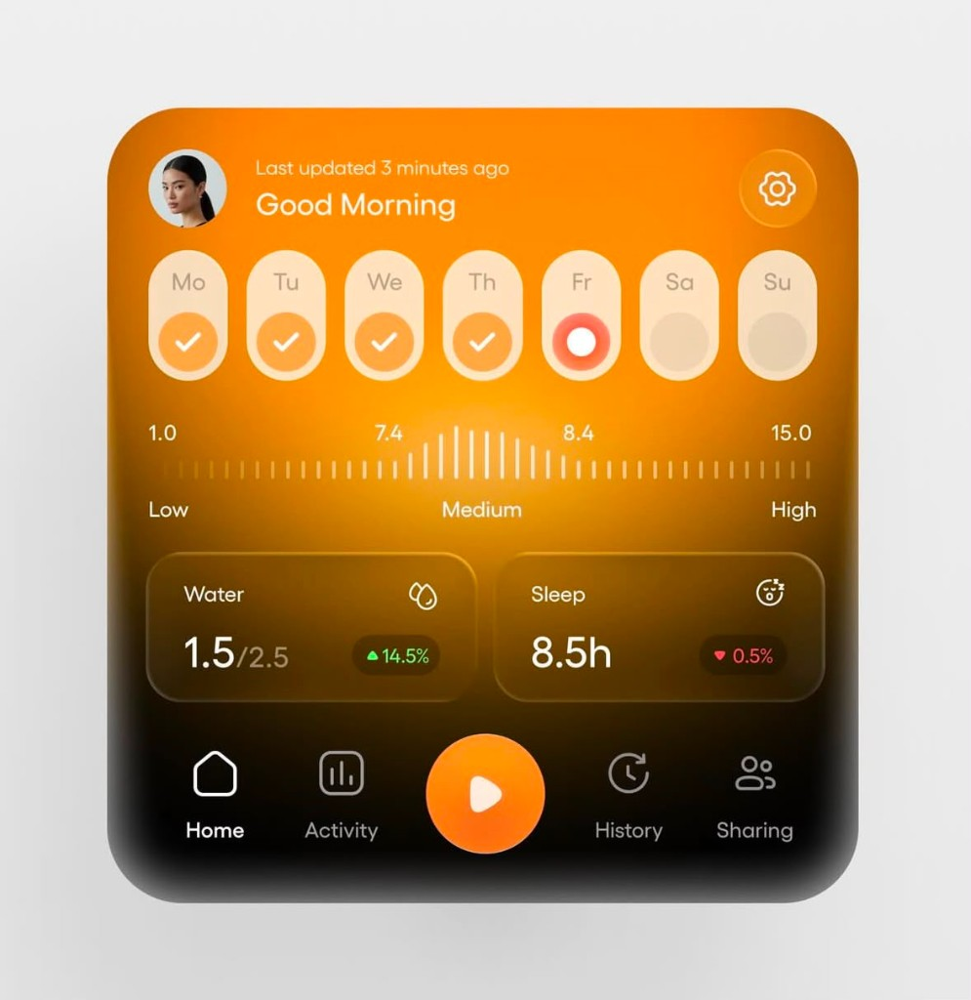
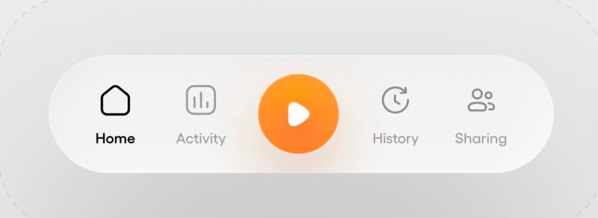
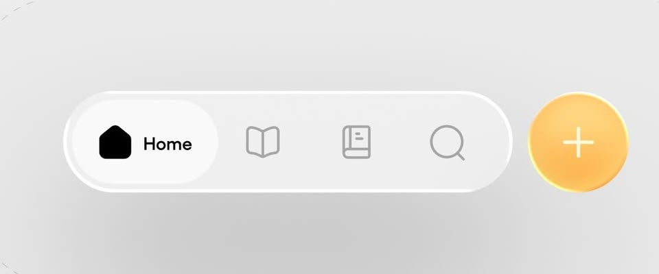

# Design System — Circuit v1

> **Status: DRAFT — new visual language** for **Circuit** (film‑production planning), taken from
> the provided screenshots. This is the **styling source of truth** for the v1 restyle.
> The screenshot **content** (Good Morning / Water / Sleep / streak / gauge) is only a **style
> example** — Circuit keeps its **own screens** (projects, tasks, schedule, team). Apply these
> tokens/patterns to Circuit's screens; **layout + content come from the PDF (pending)** — do
> **not** copy the PDF's styling. Hex values are read from the screenshots and are
> **approximate**; confirm exact tokens with the designer (**TBD**).

## Reference screenshots





---

## 1. Brand & mood

Warm, energetic, **light** UI with a signature **orange→amber gradient**, heavy use of
**glassmorphism** (translucent white pills, soft shadows), very **rounded** geometry
(pill‑shaped containers, circular action button), and a dramatic gradient hero card that
fades **orange → near‑black** at the bottom.

---

## 2. Color tokens (approximate — confirm TBD)

```ts
export const colors = {
  // Brand — orange→amber
  brand: '#F47A1F',          // primary orange
  brandStrong: '#E8650C',    // pressed / emphasis
  brandSoft: 'rgba(244,122,31,0.12)',
  amber: '#F9B233',          // FAB / secondary accent
  amberLight: '#FCC55A',

  // Hero gradient (top → bottom on the home card)
  heroFrom: '#FFA033',
  heroMid: '#F2790E',
  heroTo: '#140D06',         // fades to near-black

  // Neutrals (light theme)
  bg: '#ECECEC',             // app background
  surface: '#FFFFFF',        // cards / nav
  surfaceGlass: 'rgba(255,255,255,0.65)', // translucent pills
  border: 'rgba(0,0,0,0.06)',

  textPrimary: '#141414',
  textSecondary: '#5C5C5C',
  textMuted: '#9B9B9B',
  onBrand: '#FFFFFF',        // text/icons on orange

  // Semantic (trend pills)
  success: '#1E8E5A',        // ▲ positive
  successSoft: 'rgba(30,142,90,0.15)',
  danger: '#C23B2E',         // ▼ negative
  dangerSoft: 'rgba(194,59,46,0.15)',
  warning: '#E0A24A',
  info: '#3B82F6',
} as const;
```

> These replace the previous dark "stage black + champagne gold" tokens in
> `src/theme/tokens.ts`. Exact hex/gradients are **TBD** pending design hand‑off.

---

## 3. Typography

System font stack (San Francisco / Roboto). Tight, bold headings; large numerals for stats.

| Token | Size / weight | Use |
|---|---|---|
| `display` | 34 / 700 | Big stat numbers (e.g. `8.5h`) |
| `title` | 26 / 700 | Greeting ("Good Morning") |
| `heading` | 17 / 600 | Card titles |
| `body` | 15 / 400 | Default text |
| `caption` | 13 / 400 | "Last updated…", labels |
| `micro` | 11 / 600, +1.2 tracking, UPPERCASE | Tab labels, scale ticks |

> Exact type scale/weights **TBD**; above mirrors current scale and matches the screenshots.

---

## 4. Radius, spacing, elevation

| Token | Value | Notes |
|---|---|---|
| `radius.card` | 28 | Hero + stat cards |
| `radius.pill` | 999 | Nav bar, day chips, FAB |
| `radius.md` | 16 | Inner controls |
| `spacing` | 4 / 8 / 12 / 16 / 24 / 32 | 4‑pt scale |
| Elevation | soft, low‑opacity, large‑blur shadows | glass look; FAB has a stronger drop shadow |

---

## 5. Components (from screenshots)

### 5.1 Bottom navigation (primary)
Floating **pill** bar, translucent white, 5 slots: `Home · Activity · ◉ · History · Sharing`.
Center slot is a raised **circular orange FAB** with a white play glyph = **start a session**.
Active label is bold near‑black; inactive is muted gray. (See `nav-primary.png`.)

> Alternate variant (`nav-alt.png`): pill with active item showing a filled label
> ("● Home"), trailing icons, and a **separate amber `＋` FAB** outside the pill. Final IA is **TBD**.

### 5.2 Hero / Home card
Full‑bleed rounded card with the orange→black gradient containing: header row
(avatar, "Last updated…", greeting, gear), the **weekly streak row**, the **intensity gauge**,
and the **stat cards**.

### 5.3 Weekly streak chips
Row of 7 vertical pills (`Mo–Su`). States: **done** (filled orange + white check),
**today** (white dot, red ring), **future** (empty translucent).

### 5.4 Intensity gauge
Horizontal ticked scale `1.0 → 15.0` with `Low / Medium / High` zone labels and a centered
marker (~`7.4–8.4`). What it controls is **TBD** (see backend `PRODUCT.md`).

### 5.5 Stat card
Translucent rounded card: title + icon, large value (`1.5/2.5`, `8.5h`), and a **trend pill**
(`▲14.5%` green / `▼0.5%` red).

### 5.6 FAB
Circular, amber/orange, soft glow shadow; center play (`◉`) or `＋` depending on nav variant.

---

## 6. Motion (proposed)

- Tab switch: cross‑fade + subtle scale on active label.
- FAB press: spring scale 0.94 → 1, haptic (light).
- Streak check: pop + check‑draw.
- Use `react-native-reanimated` (already a dependency). Exact timings **TBD**.

---

## 7. Implementation notes

- Replace `src/theme/tokens.ts` with the tokens above; keep the `theme/index.ts` export shape.
- App chrome: update `app.json` `splash.backgroundColor`, notification `color`, and icons to
  the new palette; product `name`/`slug`/`bundleIdentifier` are **TBD**.
- Gradients: use `expo-linear-gradient` (add dependency) for the hero card and FAB.
- Glass pills: translucent background + 1px hairline border + soft shadow.
